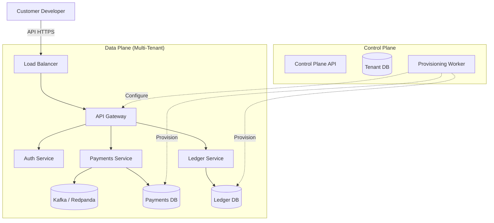

# Cloud Architecture

This document describes the architecture of the **Fintech Cloud**, a managed version of the Fintech Ecosystem platform. It is designed for high availability, security, and multi-tenant isolation.

## High-Level Overview

The Fintech Cloud operates on a **Single Control Plane, Multi-Data Plane** architecture.

- **Control Plane**: Centralized management service that handles tenant provisioning, billing, and system-wide configuration.
- **Data Plane**: Where the actual fintech services (Payments, Ledger, Auth) run. Tenants are isolated within the data plane.

## Tenant Isolation Strategies

We support two tiers of isolation:

### 1. Logical Isolation (Standard Tier)
- **Compute**: Shared Kubernetes pods processing requests for all tenants.
- **Database**: Shared PostgreSQL instance, but **separate schemas** (search_paths) per tenant.
- **Cache**: Shared Redis with namespaced keys (`tenant_id:key`).
- **Messaging**: Shared Kafka topics with headers containing `tenant_id`.

### 2. Physical Isolation (Enterprise Tier)
- **Compute**: Dedicated Kubernetes implementations (Node Pools not strictly required, but isolated pods).
- **Database**: Dedicated PostgreSQL instances or clusters.
- **Cache**: Dedicated Redis instances.
- **Messaging**: Dedicated Kafka topics or clusters.

*Note: The current v2.x implementation focuses on **Logical Isolation**.*

## Infrastructure Components

The managed platform runs on AWS (primary target) using industry-standard cloud native technologies:

| Component | Technology | Managed Service (AWS) |
|-----------|------------|-----------------------|
| **Compute** | Kubernetes | EKS (Elastic Kubernetes Service) |
| **Database** | PostgreSQL 15+ | RDS for PostgreSQL |
| **Caching** | Redis 7+ | ElastiCache for Redis |
| **Event Streaming** | Kafka-compatible | MSK (Managed Streaming for Kafka) |
| **Load Balancing** | L7 Ingress | ALB (Application Load Balancer) |
| **Secrets** | Secrets Management | AWS Secrets Manager |
| **Monitoring** | Prometheus/Grafana | Amazon Managed Prometheus / Grafana |
| **Logs** | Loki / CloudWatch | CloudWatch Logs |

## Security Architecture

security is paramount for a fintech cloud.

1.  **Network Security**:
    - All services run in private subnets.
    - Only the ALB and Control Plane API are public-facing.
    - Strict Security Groups allowing only necessary Traffic.
    - mTLS for service-to-service communication (via Linkerd or Istio).

2.  **Data Security**:
    - **Encryption at Rest**: AES-256 for all DBs, S3 buckets, and EBS volumes.
    - **Encryption in Transit**: TLS 1.3 everywhere.
    - **Key Management**: AWS KMS for master keys.

3.  **Authentication**:
    - **Control Plane**: Admin access via SSO/OIDC.
    - **Data Plane API**: API Keys (hashed) + JWT for sessions.
    - **Database Access**: IAM Authentication for RDS (no hardcoded passwords).

## Deployment Pipeline

Deployment is managed via GitOps (ArgoCD):

1.  **Code Commit** -> CI (GitHub Actions) -> Build Docker Image.
2.  **Update Manifests** -> Helm Chart version bump.
3.  **ArgoCD** detects change -> Syncs to Management Cluster.
4.  **Control Plane** propagates config updates to Data Plane.
